# Portal Arcanjo SA

Portal institucional estático empacotado em container e publicado em nuvem.

A imagem `nginx:alpine` é publicada no Docker Hub e no Amazon ECR e roda em uma
EC2 provisionada por Terraform. Build, publicação e deploy são automatizados por
GitHub Actions — não há etapa manual.

## Estrutura

```
app/                   index.html + Dockerfile
infra/                 Terraform: VPC, subnet, IGW, rotas, SG, ECR, IAM, EC2
.github/workflows/     ci.yml (lint, build, validate) e cd.yml (provisiona e implanta)
```

## Arquitetura

VPC `10.0.0.0/24` com sub-rede pública, internet gateway e rota `0.0.0.0/0`
associada. O security group libera apenas a porta 80; não há porta 22 aberta, e
o acesso à instância é feito por SSM Session Manager.

A instância Amazon Linux 2023 grava `/usr/local/bin/deploy.sh` no primeiro boot,
instala o Docker e sobe o container. O pipeline reutiliza esse mesmo script no
deploy — não são caminhos paralelos. O pull do ECR usa IAM role, sem credencial
gravada em disco.

O estado do Terraform fica em um bucket S3 versionado e criptografado, criado
pelo próprio workflow de forma idempotente.

## Pipeline

Tudo em **Secrets** (Settings → Secrets and variables → Actions):

| Secret                  | Valor                               |
| ----------------------- | ----------------------------------- |
| `AWS_ACCESS_KEY_ID`     | access key do usuário IAM           |
| `AWS_SECRET_ACCESS_KEY` | secret dessa access key             |
| `AWS_REGION`            | `us-east-1`                         |
| `DOCKERHUB_USERNAME`    | usuário do Docker Hub               |
| `DOCKERHUB_TOKEN`       | Docker Hub → Personal access tokens |

O id da instância e o endereço do ECR não são cadastrados em lugar nenhum: saem
dos outputs do Terraform durante a execução.

**CD**, a cada push na `main`: bootstrap do bucket de estado → `terraform apply`
→ leitura dos outputs → um `docker build` gerando quatro tags (`cp04` e o SHA,
no ECR e no Docker Hub) → espera o agente SSM → deploy via Send-Command →
`curl` no IP público confirmando que o portal responde.

**CI**, em pull request: `hadolint`, build da imagem com smoke test, e
`terraform fmt -check` + `validate`.

## Rodar localmente

```bash
docker build -t portal:teste ./app
docker run -d --name portal-teste -p 80:80 portal:teste   # http://localhost
docker rm -f portal-teste
```

Validar a infra sem aplicar:

```bash
cd infra
terraform fmt -check -recursive && terraform init -backend=false && terraform validate
```

## Destruir

O estado vive no S3, então o destroy precisa do mesmo backend:

```bash
cd infra
CONTA=$(aws sts get-caller-identity --query Account --output text)
terraform init -input=false \
  -backend-config="bucket=cp04-devops-tfstate-$CONTA" \
  -backend-config="key=cp04-devops/terraform.tfstate" \
  -backend-config="region=us-east-1" \
  -backend-config="use_lockfile=true"
terraform destroy
```

O bucket de estado não é removido pelo destroy — apague à parte, se quiser.

---

# Evidências

## 1. Site personalizado

Integrantes, RMs e turma:

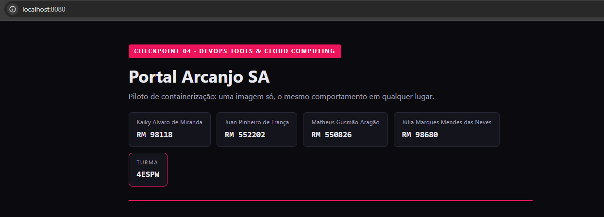

Resumo de cgroups e namespaces:

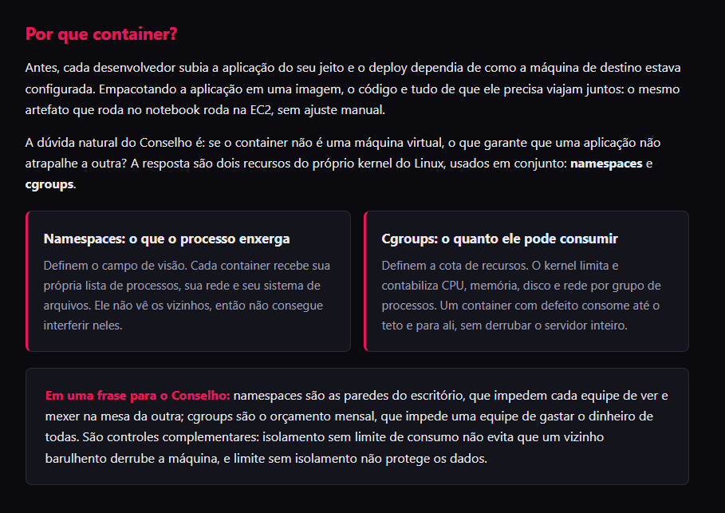
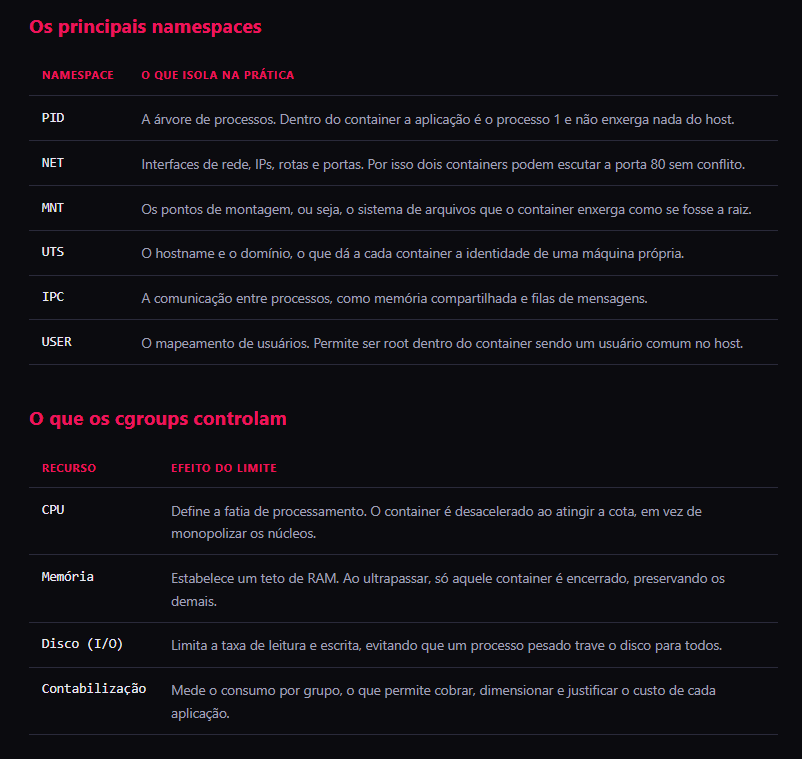
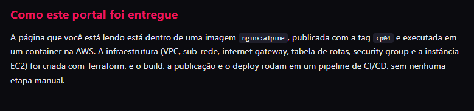

## 2. Dockerfile e build

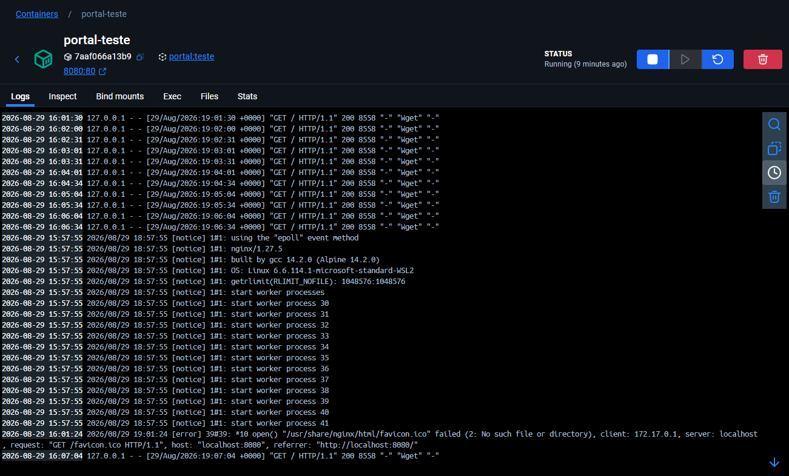
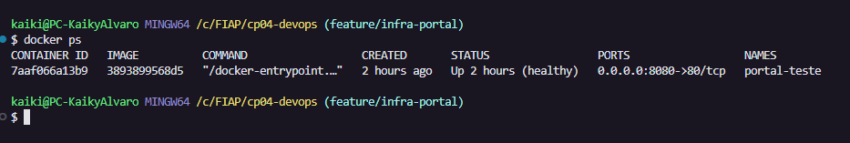

## 3. Imagem pública no Docker Hub com a tag `cp04`

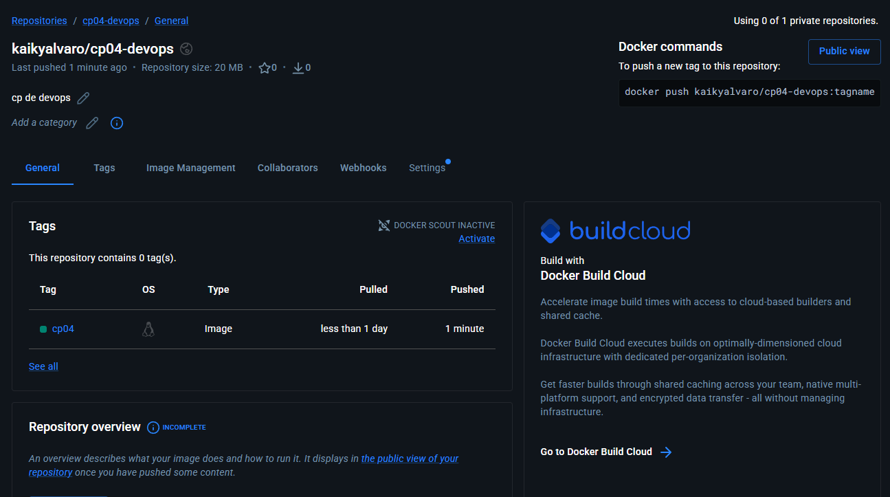
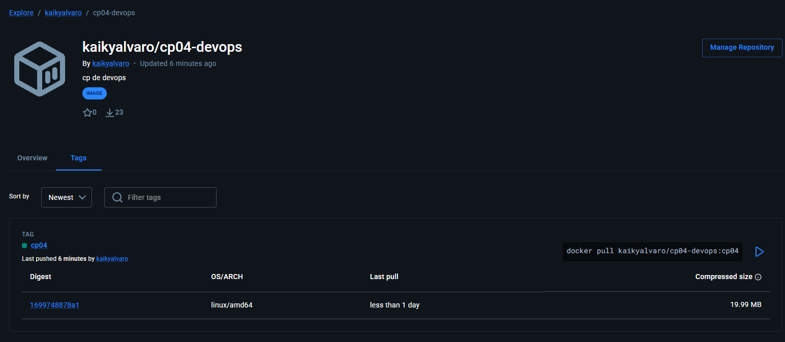

## 4. Container rodando na nuvem

Execução do CD:

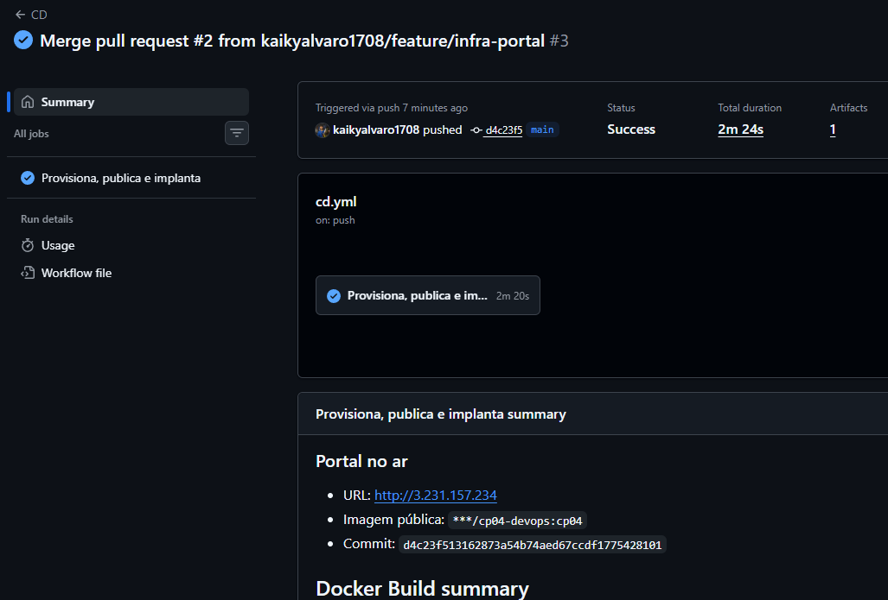

Instância em estado *running*:

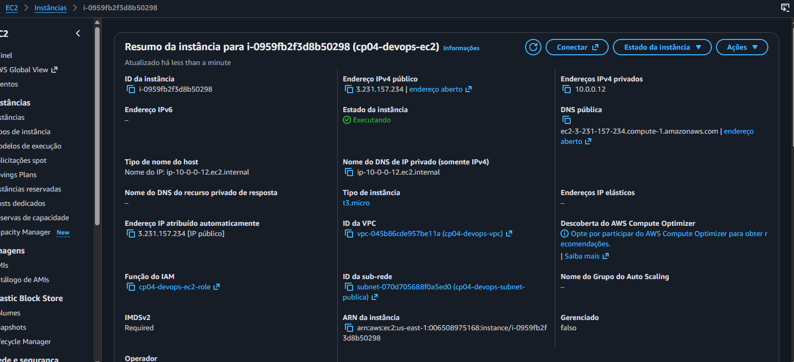

Portal aberto no IP público:

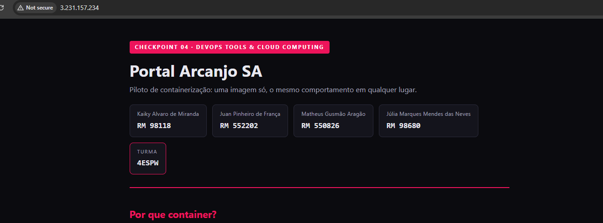

`docker ps` dentro da EC2, via Session Manager:

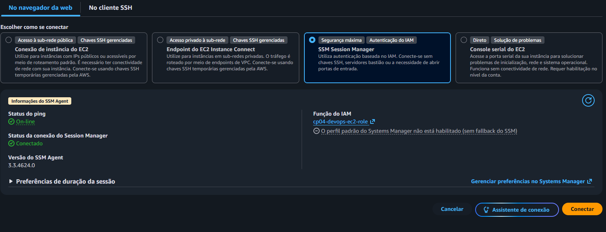
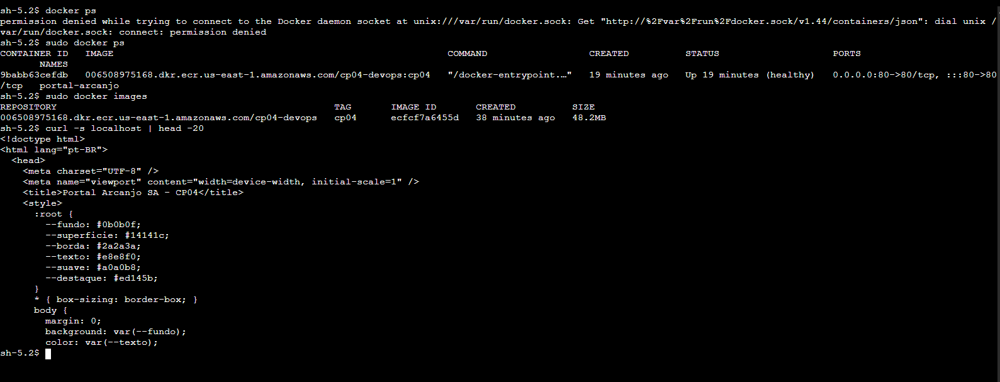

## 5. Infraestrutura e pipelines

VPC, sub-rede, IGW e tabela de rotas:

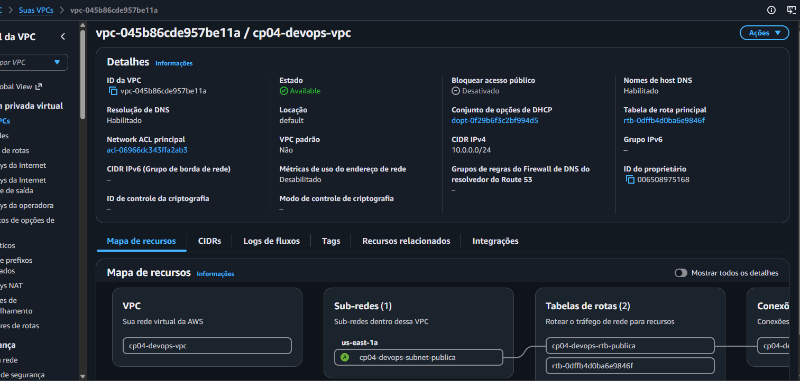

Security group com a regra da porta 80:

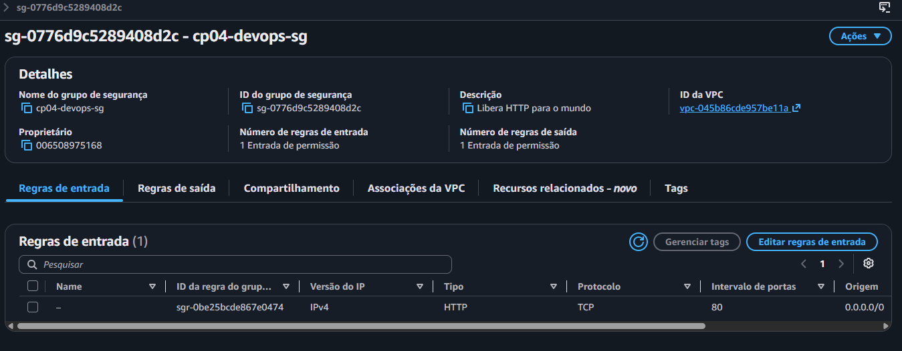

Workflows CI e CD:

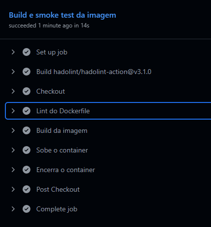
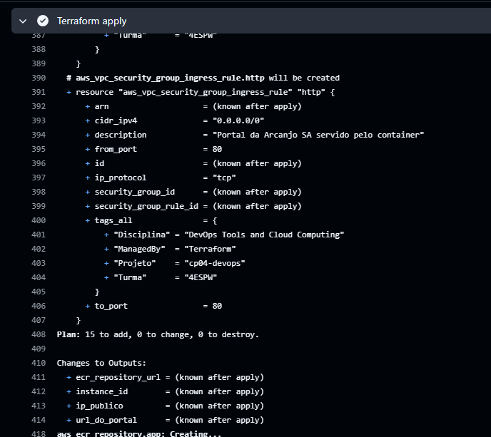

Repositório ECR e instância:

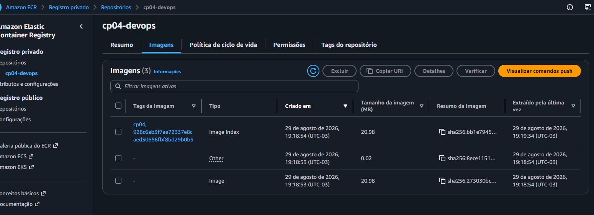
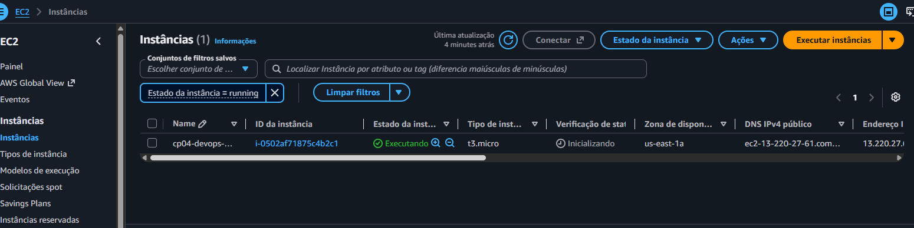
